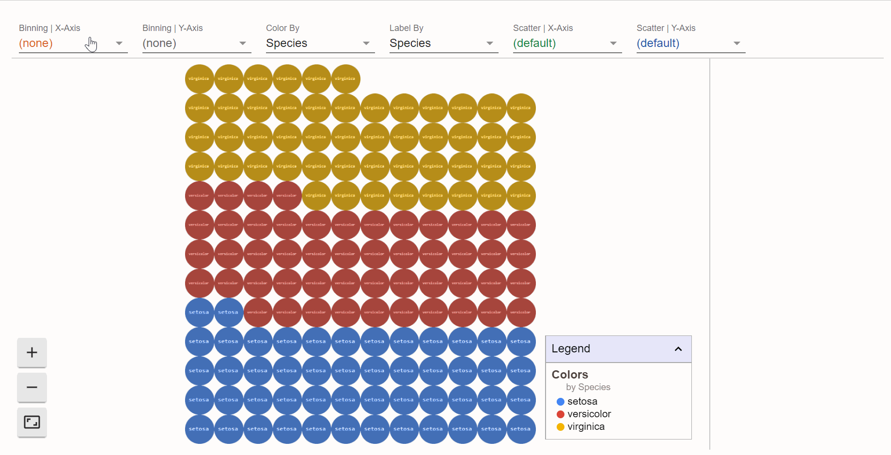

<!-- README.md is generated from README.Rmd. Please edit that file -->

```{r, include = FALSE}
knitr::opts_chunk$set(
  collapse = TRUE,
  comment = "#>",
  fig.path = "man/figures/README-",
  out.width = "100%"
)
```
# facetsr

<!-- badges: start -->
[](https://www.tidyverse.org/lifecycle/#experimental)
<!-- badges: end -->

The goal of facetsr is to create an R wrapper for facets.

I watched the presentation from RStudio 2020 Conf on [Data, visualization, and designing AI - Fernanda Viegas & Martin Wattenberg](https://resources.rstudio.com/rstudio-conf-2020/data-visualization-and-designing-ai-fernanda-viegas-and-martin-wattenberg).  Facets library discussed there were quite inspiring but I couldn’t find an R wrapper for that so I have created my own. I believe it can be used for more than just  AI data. You can take a look but, please, note the package is just a  proof of concept.

If you find it useful, I’d appreciate your feedback.


## Facets information

- [Facetes homepage](https://pair-code.github.io/facets/)
- [RStudio 2020 Conf Keynote Presentation](https://resources.rstudio.com/rstudio-conf-2020/data-visualization-and-designing-ai-fernanda-viegas-and-martin-wattenberg)

## Installation

You can install the released version of facetsr from [github](https://github.com/openpharma/facetsr) with:

``` r
remotes::install_github("openpharma/facetsr")
```

## Example

This is a basic example which shows how to start using facets. 



```R
library(facetsr)

# facets dive
facets_dive(iris)
# facets overview
facets_overview(iris)
facets_overview(list(list(data = iris, name = "iris"), list(data = cars, name = "cars")))
```

## Shiny

You can use facetsr in shiny apps.

Example:
```R
# app.R
library(shiny)
library(facetsr)

server <- function(input, output, session) {
  output$facets<- render_facets({
    facets(iris)
  })
}

ui <- fluidPage(
  facets_output("facets")
)

shinyApp(ui = ui, server = server)
```

## Rmarkdown

**Note: For Rmarkdown only facets_div is working.**

Use standard R chunks to load librarry
```{r comment = "", echo = FALSE}
"{r facets_dive}
facets_dive(datasets::airquality)
" -> my_code_string

cat("```", my_code_string, "```", sep = "")
```


## Feedback and contribution
Just don’t hesitate of contact me or opening pull request.

